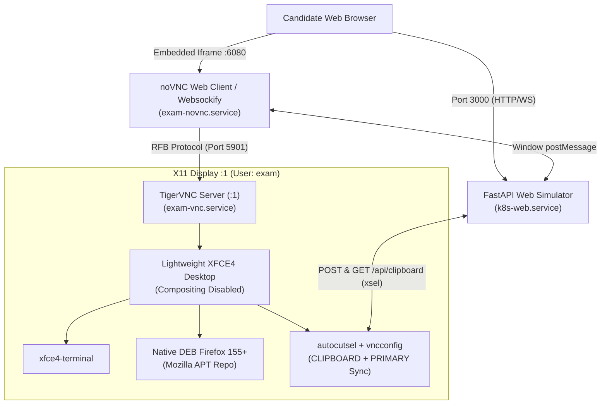

# CKA Exam Simulator — Platform Setup & Replication Guide

This guide documents the exact architecture, dependencies, and procedures to replicate the **CKA Exam Simulator platform** on any fresh Ubuntu Linux VM (Ubuntu 22.04 LTS or Ubuntu 24.04 LTS).

This document focuses specifically on the **platform infrastructure** (lightweight XFCE desktop, TigerVNC, noVNC web proxy, bidirectional clipboard bridge, keyboard lock, browser environment, and systemd services).

---

## Architecture Overview



### Key Highlights
- **Ultra-Low Memory Footprint**: ~100–120 MiB RAM idle for the entire remote desktop stack (compared to 1.5–2.5 GiB for default Ubuntu desktop / GNOME / heavy Electron terminals).
- **Near-Zero CPU Idle Overhead**: Software compositing disabled in `xfwm4` to eliminate LLVMpipe software OpenGL rendering over VNC.
- **Native DEB Firefox**: Avoids Ubuntu Snap confinement issues (`/system.slice/... is not a snap cgroup`) and runs natively inside the VNC systemd slice.
- **Seamless Bidirectional Clipboard**: Full sync between host OS and remote desktop terminal (via both RFB cut-text and instantaneous X11 `xsel` buffer injection).
- **1-Click Code Snippet Copying**: Any inline code (e.g. `` `ls` ``, `` `kubectl get pods` ``) is copied to host and VNC desktop with animated visual feedback.
- **Hardware Keyboard Capture**: Browser keyboard lock prevents browser hotkeys from hijacking candidate actions (e.g., <kbd>Escape</kbd> for vim, <kbd>Tab</kbd> for shell completion).

---

## 1-Command Automated Provisioning

If you have cloned this repository onto a fresh Ubuntu VM:

```bash
cd /root/cka-labs
sudo ./tools/setup-platform.sh
```

The script is **fully automated and idempotent**. It installs all dependencies, configures users, patches noVNC, sets up systemd services, tunes OS timers, and starts everything.

---

## Detailed Manual Step-by-Step Guide

If you prefer to configure the VM manually or understand each component in detail, follow the steps below.

---

### Step 1: Remove Desktop Bloat & Unneeded Window Managers

Many cloud images or pre-installed desktop packages include display managers and heavy window managers that compete for display `:1` or spawn software OpenGL loops.

```bash
sudo apt-get update -qq

# Purge conflicting window managers, display managers, and audio/printer bloat
sudo apt-get purge -y \
    openbox \
    sddm \
    lubuntu-* \
    lxqt-* \
    alacritty \
    speech-dispatcher \
    orca \
    blueman \
    printer-driver-* \
    cups* \
    spice-vdagent

sudo apt-get autoremove -y --purge
```

> [!NOTE]
> `spice-vdagent` frequently runs into infinite error loops on headless VNC environments without SPICE channels, consuming up to 50–90% CPU. Purging it keeps CPU idle above 95%.

---

### Step 2: Install Core XFCE & VNC Packages

Install XFCE4, native `xfce4-terminal`, TigerVNC, Websockify, noVNC, and clipboard tools:

```bash
sudo apt-get install -y \
    xfce4 \
    xfce4-terminal \
    dbus-x11 \
    tigervnc-standalone-server \
    novnc \
    websockify \
    autocutsel \
    xsel \
    xclip \
    curl \
    jq \
    nano \
    git \
    python3 \
    python3-pip \
    python3-venv \
    python3-yaml
```

---

### Step 3: Configure Ubuntu 24.04 AppArmor User Namespaces

Ubuntu 24.04 enables unprivileged user namespace restrictions by default (`kernel.apparmor_restrict_unprivileged_userns = 1`), which causes modern web browser sandboxes to crash with `EPERM`:

```bash
sudo bash -c 'cat << EOF > /etc/sysctl.d/99-disable-userns-restriction.conf
kernel.apparmor_restrict_unprivileged_userns = 0
EOF'

sudo sysctl --system
```

---

### Step 4: Install Native DEB Mozilla Firefox (Official APT Repo)

> [!IMPORTANT]
> **Do not use the Ubuntu Snap version of Firefox.** Snap confinement breaks when launched inside a systemd user service slice (`/system.slice/exam-vnc.service is not a snap cgroup for tag snap.firefox.firefox`).

1. Remove snap Firefox if present:
   ```bash
   sudo snap remove firefox 2>/dev/null || true
   ```

2. Add Mozilla's official APT signing key and repository:
   ```bash
   sudo install -d -m 0755 /etc/apt/keyrings
   curl -fsSL https://packages.mozilla.org/apt/repo-signing-key.gpg | sudo gpg --dearmor -o /etc/apt/keyrings/packages.mozilla.org.asc

   sudo bash -c 'cat << EOF > /etc/apt/sources.list.d/mozilla.list
   deb [signed-by=/etc/apt/keyrings/packages.mozilla.org.asc] https://packages.mozilla.org/apt mozilla main
   EOF'
   ```

3. Pin Mozilla APT packages with priority 1000 to prevent Ubuntu from pulling the snap wrapper:
   ```bash
   sudo bash -c 'cat << EOF > /etc/apt/preferences.d/mozilla
   Package: *
   Pin: origin packages.mozilla.org
   Pin-Priority: 1000

   Package: firefox*
   Pin: release o=Ubuntu*
   Pin-Priority: -1
   EOF'
   ```

4. Install native Firefox:
   ```bash
   sudo apt-get update -qq
   sudo apt-get install -y firefox
   ```

---

### Step 5: Configure the Candidate User (`exam`)

1. Create the `exam` candidate user:
   ```bash
   sudo useradd -m -s /bin/bash -u 1000 exam 2>/dev/null || sudo useradd -m -s /bin/bash exam
   echo "exam:exam" | sudo chpasswd
   sudo usermod -aG docker exam
   ```

2. Restrict candidate sudo to `examctl` CLI only (matching exam environment):
   ```bash
   sudo bash -c 'cat << EOF > /etc/sudoers.d/examctl
   exam ALL=(root) NOPASSWD: /root/cka-labs/labctl tasks, /root/cka-labs/labctl status, /root/cka-labs/labctl next, /root/cka-labs/labctl prev, /root/cka-labs/labctl jump *, /root/cka-labs/labctl flag, /root/cka-labs/labctl flag *, /root/cka-labs/labctl unflag, /root/cka-labs/labctl unflag *
   EOF'
   sudo chmod 0440 /etc/sudoers.d/examctl
   sudo rm -f /etc/sudoers.d/exam
   ```

3. Configure shell defaults and editor:
   ```bash
   sudo bash -c 'cat << EOF >> /home/exam/.bashrc

   # CKA Exam Environment Defaults
   export EDITOR="nano"
   export KUBE_EDITOR="nano"
   alias k="kubectl"
   alias kgp="kubectl get pods"
   alias kgn="kubectl get nodes"
   alias dr="--dry-run=client -o yaml"
   EOF'
   ```

---

### Step 6: Configure XFCE4 & TigerVNC for User `exam`

1. Create directories:
   ```bash
   sudo install -d -m 0700 -o exam -g exam /home/exam/.vnc
   sudo install -d -m 0755 -o exam -g exam /home/exam/Desktop
   sudo install -d -m 0755 -o exam -g exam /home/exam/.config/xfce4/xfconf/xfce-perchannel-xml
   ```

2. Create `/home/exam/.vnc/xstartup`:
   ```bash
   sudo bash -c 'cat << "EOF" > /home/exam/.vnc/xstartup
   #!/bin/sh
   unset SESSION_MANAGER
   unset DBUS_SESSION_BUS_ADDRESS
   export XKL_XMODMAP_DISABLE=1
   autocutsel -fork
   autocutsel -selection PRIMARY -fork
   vncconfig -nowin &
   exec startxfce4
   EOF'

   sudo chmod +x /home/exam/.vnc/xstartup
   sudo chown exam:exam /home/exam/.vnc/xstartup
   ```

3. **Disable compositing in `xfwm4`** (crucial for performance over VNC):
   ```bash
   sudo bash -c 'cat << "EOF" > /home/exam/.config/xfce4/xfconf/xfce-perchannel-xml/xfwm4.xml
   <?xml version="1.1" encoding="UTF-8"?>
   <channel name="xfwm4" version="1.0">
     <property name="general" type="empty">
       <property name="use_compositing" type="bool" value="false"/>
       <property name="borderless_maximize" type="bool" value="true"/>
       <property name="click_to_focus" type="bool" value="true"/>
     </property>
   </channel>
   EOF'

   sudo chown -R exam:exam /home/exam/.config
   ```

4. Create Desktop Shortcuts:
   ```bash
   # Terminal Shortcut
   sudo bash -c 'cat << "EOF" > /home/exam/Desktop/terminal.desktop
   [Desktop Entry]
   Version=1.0
   Type=Application
   Name=Terminal
   Comment=Xfce Terminal
   Exec=/usr/bin/xfce4-terminal
   Icon=org.xfce.terminal
   Terminal=false
   Categories=System;TerminalEmulator;
   EOF'

   # Firefox Shortcut
   sudo bash -c 'cat << "EOF" > /home/exam/Desktop/firefox.desktop
   [Desktop Entry]
   Version=1.0
   Type=Application
   Name=Firefox Web Browser
   Comment=Access the Web
   Exec=/usr/bin/firefox %u
   Icon=firefox
   Terminal=false
   Categories=Network;WebBrowser;
   EOF'

   sudo chmod +x /home/exam/Desktop/*.desktop
   sudo chown -R exam:exam /home/exam/Desktop
   ```

---

### Step 7: Patch noVNC (`/usr/share/novnc/vnc.html`)

noVNC requires two client-side scripts to enable hardware keyboard capture and bidirectional clipboard synchronization with the simulator parent window.

Add the following before `</body>` in `/usr/share/novnc/vnc.html`:

```html
    <!-- Full Keyboard Lock Acquisition (Locks Esc, Tab, Alt, Ctrl) -->
    <script>
    (function() {
        function acquireKeyboardLock() {
            if (navigator.keyboard && navigator.keyboard.lock) {
                navigator.keyboard.lock(['Escape', 'Tab', 'AltLeft', 'AltRight', 'ControlLeft', 'ControlRight']).catch(function(){});
            }
        }
        window.addEventListener('load', acquireKeyboardLock);
        window.addEventListener('focus', acquireKeyboardLock);
        window.addEventListener('click', acquireKeyboardLock);
        window.addEventListener('pointerdown', acquireKeyboardLock);
        document.addEventListener('keydown', function(e) { acquireKeyboardLock(); }, true);
    })();
    </script>

    <!-- Host <-> VNC Bidirectional Clipboard Bridge -->
    <script>
    (function() {
        var lastSent = '';
        var lastReceived = '';
        function getRfb() { return (window.UI && window.UI.rfb) || window.rfb; }

        // Receive text from simulator host window and inject into VNC
        window.addEventListener('message', function(e) {
            if (!e.data) return;
            if (e.data.type === 'SET_CLIPBOARD' && typeof e.data.text === 'string') {
                var text = e.data.text;
                if (!text || text === lastSent) return;
                lastSent = text;
                var rfb = getRfb();
                if (rfb && rfb.clipboardPasteFrom) {
                    try { rfb.clipboardPasteFrom(text); } catch(err) {}
                }
                var clipBox = document.getElementById('noVNC_clipboard_text');
                if (clipBox) clipBox.value = text;
            }
        });

        // Intercept browser paste inside iframe
        window.addEventListener('paste', function(e) {
            var text = (e.clipboardData || window.clipboardData).getData('text');
            if (text) {
                var rfb = getRfb();
                if (rfb && rfb.clipboardPasteFrom) {
                    rfb.clipboardPasteFrom(text);
                    lastSent = text;
                }
                var clipBox = document.getElementById('noVNC_clipboard_text');
                if (clipBox) clipBox.value = text;
            }
        });

        // Forward server clipboard events back to the parent host window
        function attachRfbClipboard() {
            var rfb = getRfb();
            if (!rfb) { setTimeout(attachRfbClipboard, 500); return; }
            rfb.addEventListener('clipboard', function(ev) {
                if (ev && ev.detail && typeof ev.detail.text === 'string') {
                    var text = ev.detail.text;
                    if (!text || text === lastReceived) return;
                    lastReceived = text;
                    try { window.parent.postMessage({ type: 'VNC_CLIPBOARD', text: text }, '*'); } catch(_) {}
                    if (navigator.clipboard && navigator.clipboard.writeText) {
                        navigator.clipboard.writeText(text).catch(function() {});
                    }
                }
            });
        }
        attachRfbClipboard();

        window.addEventListener('focus', function() {
            if (navigator.clipboard && navigator.clipboard.readText) {
                navigator.clipboard.readText().then(function(text) {
                    if (text && text !== lastSent && text !== lastReceived) {
                        lastSent = text;
                        var rfb = getRfb();
                        if (rfb && rfb.clipboardPasteFrom) { rfb.clipboardPasteFrom(text); }
                    }
                }).catch(function() {});
            }
        });
    })();
    </script>
```

---

### Step 8: Configure Systemd Services

Create the three production services:

#### 1. TigerVNC Server (`/etc/systemd/system/exam-vnc.service`)
```ini
[Unit]
Description=TigerVNC Server for Exam User
After=network.target

[Service]
Type=simple
User=exam
Environment=HOME=/home/exam
Environment=USER=exam
ExecStartPre=-/usr/bin/vncserver -kill :1
ExecStart=/usr/bin/vncserver :1 -fg -geometry 1920x1080 -depth 24 -SecurityTypes None -localhost yes -AlwaysShared --I-KNOW-THIS-IS-INSECURE
ExecStop=/usr/bin/vncserver -kill :1
Restart=always
RestartSec=3

[Install]
WantedBy=multi-user.target
```

#### 2. noVNC Websockify Proxy (`/etc/systemd/system/exam-novnc.service`)
```ini
[Unit]
Description=noVNC Web Proxy (Websockify)
After=network.target exam-vnc.service

[Service]
Type=simple
User=root
ExecStart=/usr/bin/websockify --web /usr/share/novnc 6080 127.0.0.1:5901
Restart=always
RestartSec=3

[Install]
WantedBy=multi-user.target
```

#### 3. Simulator Web Application (`/etc/systemd/system/k8s-web.service`)
```ini
[Unit]
Description=Kubernetes Exam Web Simulator
After=network.target

[Service]
Type=simple
User=root
WorkingDirectory=/root/cka-labs
Environment=EXAM_PRESET=medium-02-security-workloads
Environment=EXAM_ADMIN=0
Environment=VNC_DISPLAY=:1
Environment=XAUTHORITY=/home/exam/.Xauthority
Environment=EXAM_HOME=/home/exam
ExecStart=/root/cka-labs/.venv/bin/uvicorn web.server:app --host 0.0.0.0 --port 3000
Restart=always
RestartSec=3

[Install]
WantedBy=multi-user.target
```

Enable and start services:
```bash
sudo systemctl daemon-reload
sudo systemctl enable --now exam-vnc.service exam-novnc.service k8s-web.service
```

---

### Step 9: OS Tuning (Eliminate Background Spikes & Freezing)

Disable background system update timers that cause periodic CPU spikes, lock `dpkg`, and slow down terminal commands during exams:

```bash
sudo systemctl mask unattended-upgrades.service
sudo systemctl mask apt-daily.timer apt-daily-upgrade.timer
sudo systemctl mask motd-news.timer
sudo systemctl disable --now bluetooth.service ModemManager.service 2>/dev/null || true

sudo bash -c 'cat << EOF > /etc/apt/apt.conf.d/20auto-upgrades
APT::Periodic::Update-Package-Lists "0";
APT::Periodic::Download-Upgradeable-Packages "0";
APT::Periodic::AutocleanInterval "0";
APT::Periodic::Unattended-Upgrade "0";
EOF'
```

---

## Verification & Health Check

Verify all listening ports:
```bash
ss -tulpn | grep -E ':3000|:5901|:6080'
```

Expected output:
| Port | Process | Purpose |
|------|---------|---------|
| **3000** | `uvicorn` | Simulator Web UI & Task Controller |
| **5901** | `Xtigervnc` | TigerVNC Server (:1 X11 display) |
| **6080** | `websockify` | noVNC HTML5 WebSocket Gateway |

### Test Clipboard Bidirectional Bridge

**1. Host -> VNC Desktop (Injection):**
```bash
curl -s -X POST http://127.0.0.1:3000/api/clipboard \
  -H 'Content-Type: application/json' \
  -d '{"text":"echo hello from host"}'

# Verify on display :1
DISPLAY=:1 XAUTHORITY=/home/exam/.Xauthority HOME=/home/exam xsel -b -o
```

**2. VNC Desktop -> Host (Retrieval):**
```bash
# Copy text inside X11 display :1
DISPLAY=:1 XAUTHORITY=/home/exam/.Xauthority HOME=/home/exam sh -c "echo 'app.production.internal' | xsel -b -i"

# Retrieve via WebApp API (falls back to PRIMARY selection if CLIPBOARD is empty)
curl -s http://127.0.0.1:3000/api/clipboard
# Returns: {"text":"app.production.internal\n"}
```

---

## Accessing the Platform

- **Exam Candidate View**: `http://<VM-IP>:3000`
- **Exam Admin View**: `http://<VM-IP>:3000?admin=1`
- **Direct noVNC Desktop**: `http://<VM-IP>:6080/vnc.html?autoconnect=true&resize=remote`
- **Default Credentials**: User `exam`, Password `exam`, Full passwordless sudo.
